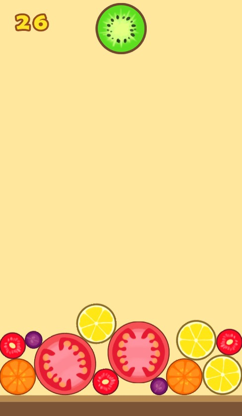

# Reinforcement Learning for a Stochastic Ball Merging Game： Daxigua

# Introduction

This project is aimed to re-implement and learn a mobile phone game, Compound Big Watermelon, which recently has been very popular in China.

In this game, we need to decide where to drop the new ball in order to remove more balls. We can remove a ball by collision with other balls of same level. The game will finish if the balls pile up over the end line.

The link to play the original game online：[Compound Big Watermelon](http://www.wesane.com/game/654/?dt_dapp=1&dt_dapp=1)

The original code of the game: [Repository(daxigua)](https://github.com/liyupi/daxigua)

# How to Run

To learn the policy, we use mainly 3 methods, you can run the following code to implement them:

-   Policy Gradient : run `python run_policy_gradient.py` in your terminal.
-   Policy Search - (1+1)-SA-ES: open the `Policy_Search_Agent_SAES.ipynb` file and run codes according to the order.
-   Policy Search - CEM: open the `Policy_Search_Agent_CEM` file and run codes according to the order.

You can change the configuration of the game in the `Config.py` file, including the balls setting, the screen size and so on.
